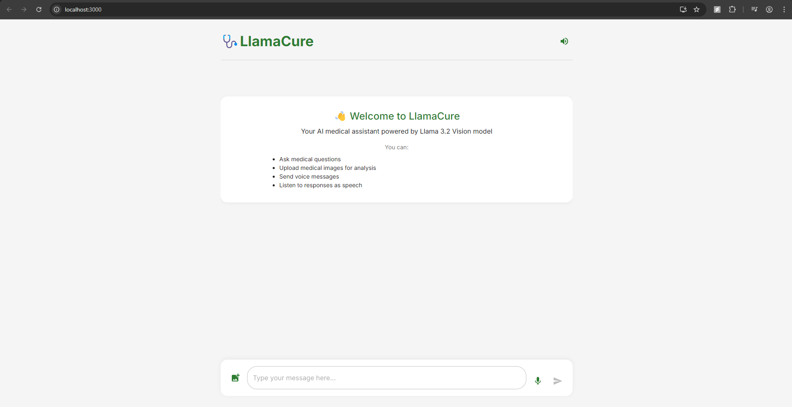
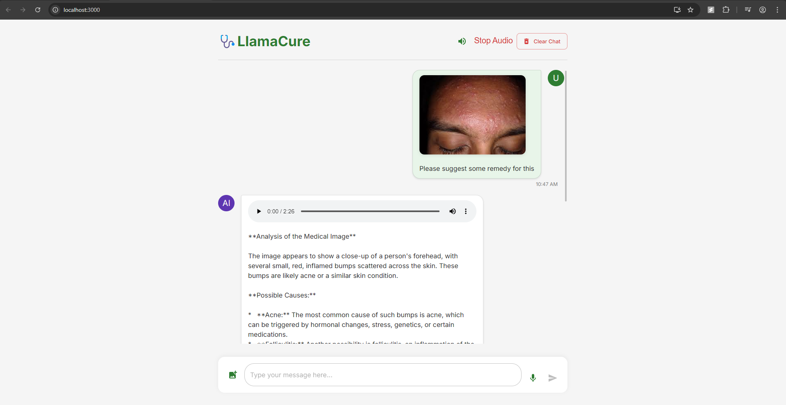
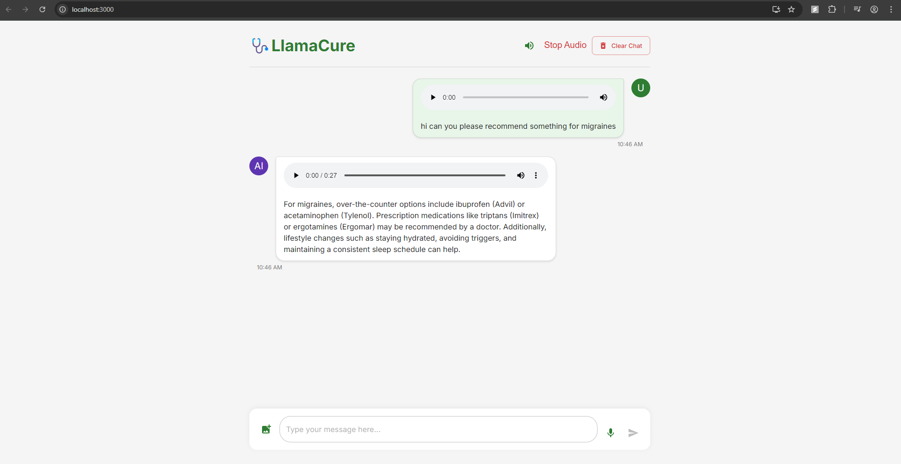

# LlamaCure - AI-powered Medical Assistant

LlamaCure is an advanced medical assistant application powered by the Llama 3.2 90B Vision Preview model through the Groq API. It provides users with medical information, image analysis capabilities, and voice interaction in a user-friendly interface.

## Features

- **Text-based Medical Chat**: Ask medical questions and receive informative responses
- **Medical Image Analysis**: Upload medical images for AI-powered analysis and interpretation
- **Voice Interaction**: Send voice messages and receive spoken responses
- **Conversation Memory**: Maintains context throughout your conversation
- **Modern, Responsive UI**: Beautiful and intuitive user interface

## Tech Stack

### Backend
- **FastAPI**: High-performance web framework for building APIs
- **Groq API**: Serves the Llama 3.2 90B Vision Preview model
- **Python 3.9+**: Core language for backend services
- **SpeechRecognition**: For audio transcription
- **gTTS (Google Text-to-Speech)**: For speech synthesis
- **Uvicorn**: ASGI server for FastAPI
- **Pydantic**: Data validation and settings management

### Frontend
- **React 19**: Latest version of the React library for building user interfaces
- **TypeScript**: Type-safe JavaScript for improved development
- **Material UI 7**: React component library for consistent design
- **Framer Motion**: Animation library for React
- **React Webcam**: For capturing images
- **Axios**: HTTP client for API requests

## Implementation Details

### LLM Integration
LlamaCure uses Llama 3.2 90B Vision Preview model via the Groq API, providing state-of-the-art medical assistance capabilities. The application maintains conversation history to provide contextually relevant responses and supports image analysis for medical images.

### Speech Processing
The application includes bidirectional voice capabilities:
- **Speech-to-Text**: Converts user's voice messages to text using Google's Speech Recognition
- **Text-to-Speech**: Converts AI responses to spoken audio using Google's Text-to-Speech

### Image Processing
The system processes uploaded medical images and sends them to the vision model along with user prompts for detailed analysis.

## Project Structure

```
llama-cure/
├── assets/
│   └── images/             # Contains result images
├── backend/
│   ├── api/
│   │   └── routes.py       # API route definitions
│   ├── config/
│   │   └── config.py       # Configuration settings
│   ├── models/
│   │   ├── llama_model.py  # LLM and vision model implementation
│   │   └── speech_model.py # Speech processing implementation
│   ├── temp/               # Temporary file storage
│   └── requirements.txt    # Python dependencies
├── frontend/
│   ├── public/             # Static assets
│   ├── src/
│   │   ├── components/     # React components
│   │   ├── context/        # React context providers
│   │   ├── services/       # API service functions
│   │   └── styles/         # UI styling
│   ├── package.json        # Node.js dependencies
│   └── tsconfig.json       # TypeScript configuration
├── run.py                  # Application entry point
└── README.md               # Project documentation
```

## Getting Started

### Prerequisites
- Python 3.9+
- Node.js 18+
- npm or yarn
- Groq API key

### Setup

1. **Clone the repository**
```bash
git clone https://github.com/yourusername/llama-cure.git
cd llama-cure
```

2. **Backend Setup**
```bash
cd backend
pip install -r requirements.txt

# Create a .env file with your Groq API key
echo "GROQ_API_KEY=your_groq_api_key_here" > .env
echo "GROQ_MODEL=llama-3.2-90b-vision-preview" >> .env
```

3. **Frontend Setup**
```bash
cd ../frontend
npm install
```

4. **Run the Application**
```bash
# In the project root directory
python run.py
```

5. **In a separate terminal, start the frontend**
```bash
cd frontend
npm start
```

6. Open your browser and navigate to `http://localhost:3000`

## API Endpoints

### Chat Endpoints
- `POST /api/chat/`
  - Process text-based chat messages
  - Request body: `{ "message": "string", "conversation_id": "string" (optional) }`
  - Response: `{ "response": "string", "conversation_id": "string" }`

### Voice Endpoints
- `POST /api/voice/transcribe`
  - Transcribe uploaded audio files to text
  - Request: FormData with audio file
  - Response: `{ "transcription": "string" }`

- `POST /api/voice/synthesize`
  - Convert text to speech
  - Request: FormData with `text` field
  - Response: Audio file (MP3)

### Vision Endpoints
- `POST /api/vision/analyze`
  - Analyze uploaded medical images
  - Request: FormData with image file and prompt
  - Response: `{ "analysis": "string", "conversation_id": "string" }`

## Results

Here are some examples of LlamaCure in action:

### Homepage


### Image Analysis


### Voice Interaction


---

LlamaCure is a research project and should not replace professional medical advice. Always consult with healthcare professionals for proper diagnosis and treatment.